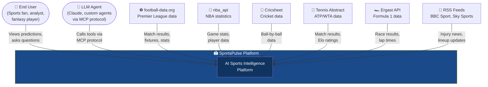
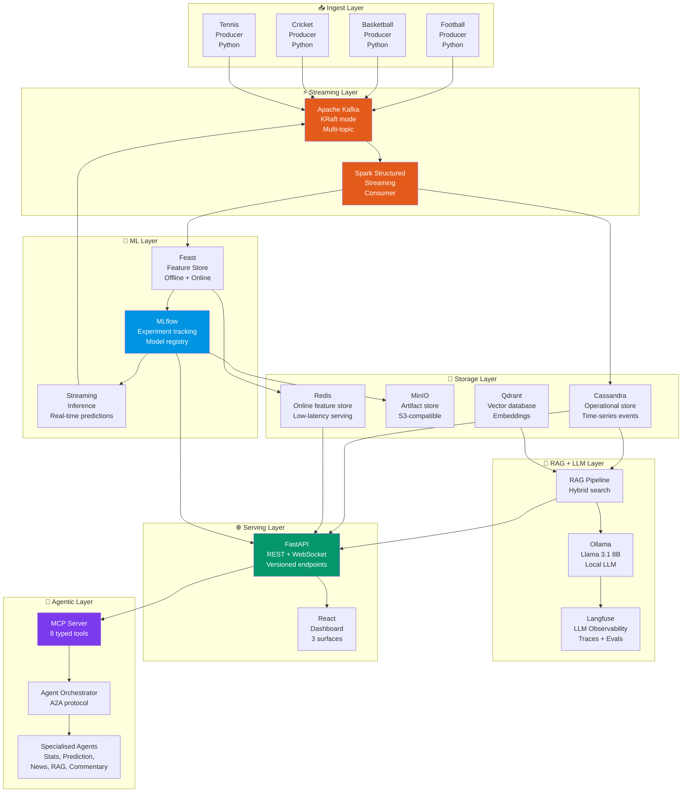
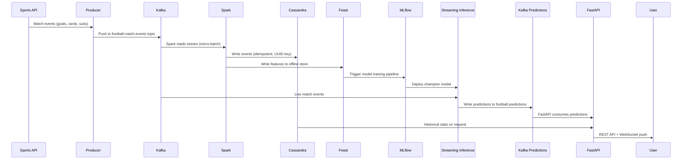
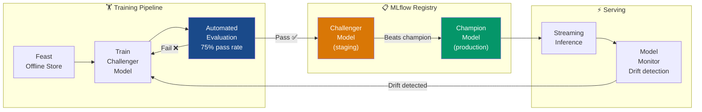
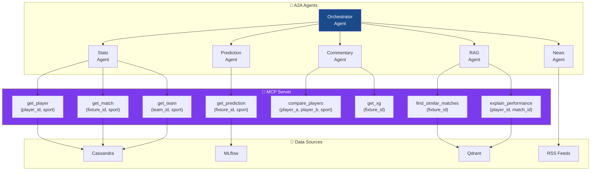

# SportsPulse — Architecture Diagrams

These diagrams follow the C4 model (Context → Container → Component).
They render automatically in GitHub and can be copied into Lucidchart/draw.io.

---

## Level 1: System Context Diagram

Shows SportsPulse and everything it connects to.

---

## Level 2: Container Diagram

Shows the major technical containers inside SportsPulse.

---

## Level 2: Data Flow Diagram

Shows how data flows through the system end-to-end.

---

## Level 2: ML Pipeline Diagram

Shows the champion/challenger model lifecycle.

---

## Level 3: MCP Server Tools

Shows the typed tool interfaces exposed to LLM agents.

---

## How to use these diagrams

### In your GitHub README
Paste any diagram block directly — GitHub renders Mermaid automatically.

### In Lucidchart / draw.io
1. Go to lucidchart.com or draw.io
2. Insert → Advanced → Edit Diagram (XML)
3. Paste the Mermaid code
4. Export as PNG/PDF for presentations

### In a slide deck
Screenshot the rendered GitHub version or export from draw.io.

### In interviews
When asked "walk me through your architecture" — open your GitHub README
and walk through the diagrams top to bottom: Context → Container → Data Flow → ML Pipeline → MCP.
Each diagram answers a different level of "how does it work?"
