# SportsPulse — Solution Design

Architecture diagrams following the C4 model (Context → Container →
Component). These render automatically on GitHub — no extension needed.

---

## Level 1: System Context Diagram

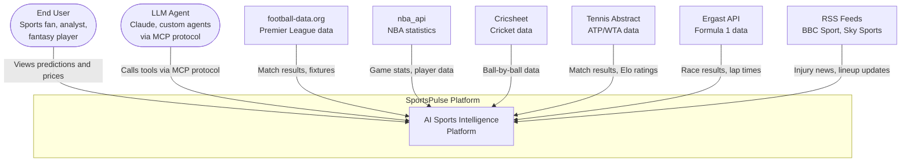

---

## Level 2: Container Diagram

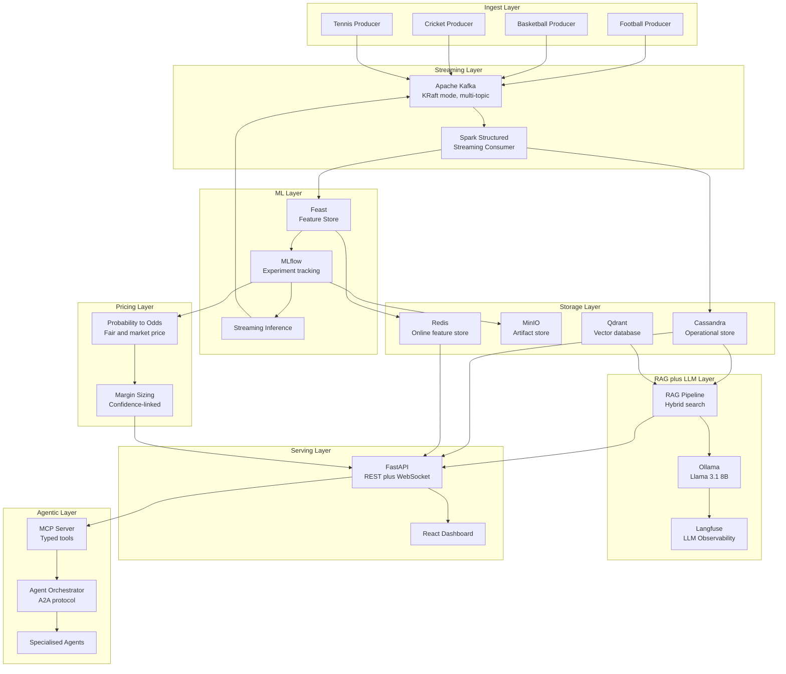

---

## Level 2: Data Flow Diagram

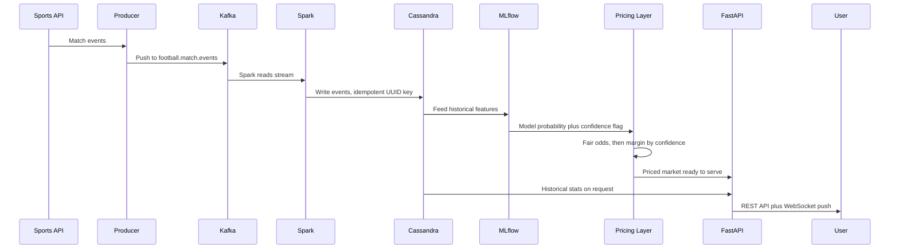

---

## Level 2: ML Pipeline Diagram

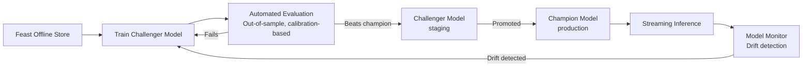

Evaluation prioritises calibration over raw accuracy — a model
that says "70%" should be correct roughly 7 times in 10, which
matters more for a downstream pricing decision than raw outcome
accuracy alone.

---

## Level 2: Pricing and Margin Diagram

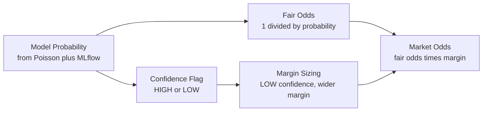

**Why confidence drives margin:** a team with no training history
(for example, newly promoted) produces a probability estimate with
more underlying uncertainty. Pricing under that uncertainty should
widen the margin to compensate for that uncertainty — the same
human-in-the-loop principle already used in this project's
confidence-scoring pattern, applied here to a pricing decision
instead of a review-queue decision.

**Worked example:**

```
Arsenal vs Coventry City
  Model probability (Arsenal win): 73%
  Confidence: LOW (Coventry has no PL history)
  Fair odds: 1 / 0.73 = 1.37
  Standard margin (HIGH confidence): 5%
  Widened margin (LOW confidence): 8%
  Market odds: 1.37 x (1 - 0.08) = 1.26
```

---

## Level 2: Pricing Optimization Engine (Detailed)

Expands the Pricing and Margin diagram above into the full decision
flow — from multiple model outputs through to a monitored, tested
pricing recommendation.

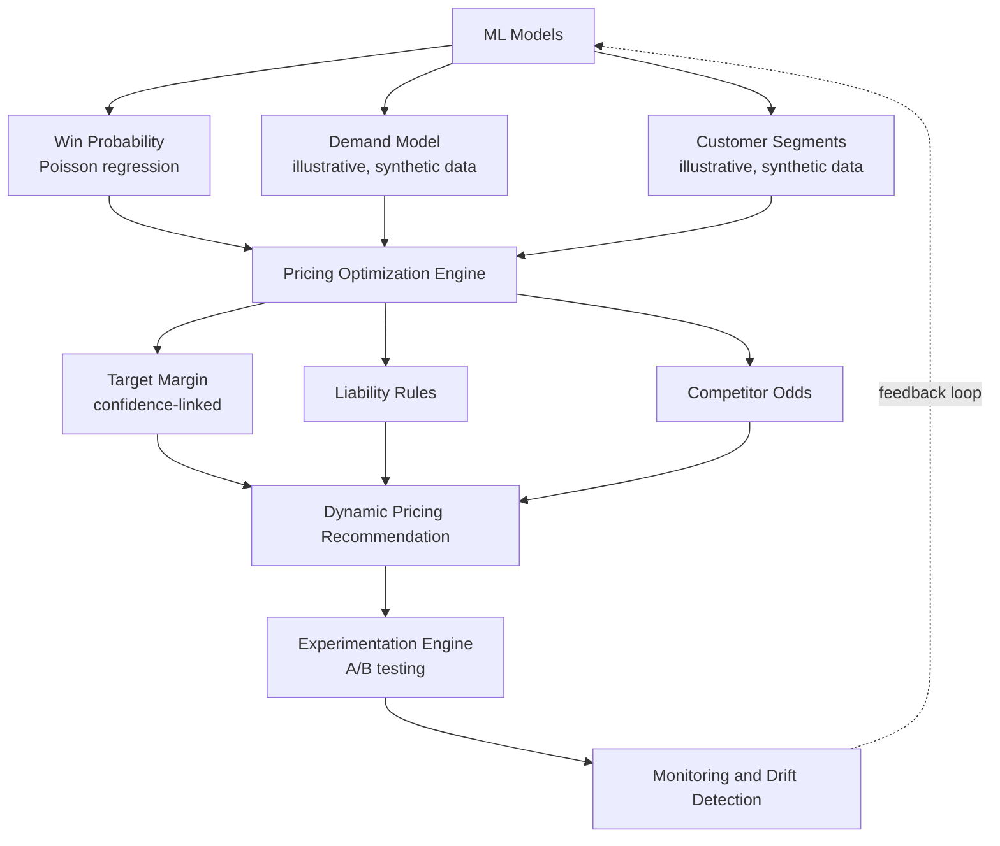

**What is built vs illustrative right now:**

| Component | Status |
|---|---|
| Win Probability (Poisson model) | Built, backtested, real data |
| Demand Model | Illustrative — synthetic data, demonstrates methodology |
| Customer Segments (K-Means) | Illustrative — synthetic data, demonstrates methodology |
| Target Margin (confidence-linked) | Built |
| Liability Rules | Conceptual — not yet implemented |
| Competitor Odds | Conceptual — would use a real odds API (e.g. The Odds API) |
| Experimentation Engine | Conceptual — champion/challenger pattern already exists in MLflow, extending to live A/B testing is the next step |
| Monitoring and Drift Detection | Conceptual — MLflow provides the tracking infrastructure this would build on |

The feedback loop (Monitoring back into ML Models) is the same
champion/challenger promotion pattern already used for the core
prediction model — retraining is triggered when monitored
performance degrades, not on a fixed schedule.

---

## Pricing Drift Detection

Expands the "Monitoring and Drift Detection" box above — what drift
actually means in a pricing context, and how it would be detected.

Two distinct types of drift matter here, and they require different
detection approaches:

### 1. Model drift (the prediction is getting worse)

The underlying Poisson model's out-of-sample accuracy or calibration
degrades over time as squads, form, and tactics change season to
season.

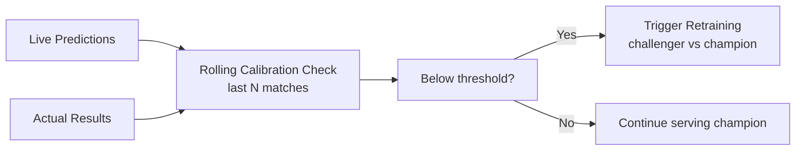

**Concretely:** track calibration (not just accuracy) on a rolling
window of the most recent matches, logged in MLflow alongside every
prediction. If calibration falls below a defined threshold — the
model is systematically over- or under-confident — that triggers
the champion/challenger retraining cycle already built into the
MLflow registry pattern.

### 2. Pricing drift (the price is diverging from the market)

Separate from model quality — this is about whether the *priced
odds* are staying reasonable relative to the wider market, regardless
of whether the underlying probability model is accurate.

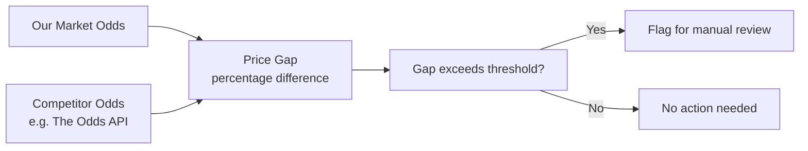

**Concretely:** a persistent, growing gap between our priced odds
and the wider market is itself a signal — either the model has found
a genuine edge (rare, worth flagging positively) or something is
wrong with the pricing logic (more likely, worth flagging for
review). This is the same underlying pattern as the confidence-flag
system already built for the model — surfacing uncertainty rather
than acting on it blindly.

### Status

| Component | Status |
|---|---|
| Rolling calibration tracking | Conceptual — would extend the existing MLflow logging |
| Automated retraining trigger | Conceptual — champion/challenger pattern already exists, this adds the automatic trigger condition |
| Competitor odds comparison | Conceptual — would require a real odds data source |
| Manual review flagging | Pattern already built — this is the same confidence-flag logic applied to a second signal |

---

## Live In-Play Price Updates

Everything above prices a match once, before kickoff. This section
covers the genuinely "dynamic" part — how the price changes as the
match itself unfolds, using the same streaming infrastructure
already built for match events.

### The mechanism

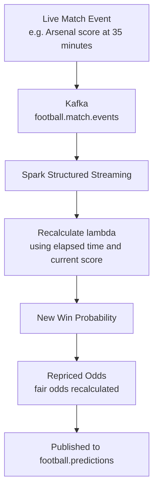

**This is architecturally already possible** — the Kafka + Spark
pipeline already streams match events in real time. What's new is
recalculating the Poisson model's lambda mid-match rather than only
once before kickoff.

### Worked example

```
Pre-match:
  Arsenal win probability: 70%
  Market odds: 1.35 (5% margin)

35th minute - Arsenal score (1-0):
  Remaining match time: 55 minutes of 90
  Recalculated lambda accounts for:
    - Goals already scored (locked in, cannot be undone)
    - Remaining time reduces further-scoring lambda
      proportionally (55/90 of original rate)
  New Arsenal win probability: 89%
  Repriced odds: 1.12 (narrower - less time for Coventry to recover)

72nd minute - Coventry score (1-1):
  Remaining match time: 18 minutes of 90
  Scores now level, very little time remaining
  New Arsenal win probability: 42%
  Repriced odds: 2.38 (widens - genuinely uncertain outcome)
```

### The actual math change — in-play lambda recalculation

The pre-match model calculates lambda for a full 90 minutes. In-play,
lambda must be rescaled to the *remaining* time and adjusted for the
*current score state* — a team already 1-0 up needs fewer additional
goals to win than a team starting from 0-0.

```python
def in_play_lambda(pre_match_lambda, elapsed_minutes, current_goals_for):
    remaining_fraction = (90 - elapsed_minutes) / 90
    # Simple time-scaling of the original rate.
    # A fuller model would also adjust for scoreline-driven
    # changes in playing style (e.g. a losing team pressing harder).
    return pre_match_lambda * remaining_fraction
```

### Status

| Component | Status |
|---|---|
| Real-time event streaming | Built — this is the existing Kafka + Spark pipeline |
| Pre-match lambda calculation | Built |
| In-play lambda recalculation | Conceptual — natural next extension of the existing model, not yet implemented |
| Live repricing and publishing | Conceptual — would reuse the existing `football.predictions` topic pattern already designed |

**Why this is a natural, not speculative, extension:** the hard
infrastructure problem — reliable, ordered, low-latency event
streaming — is already solved by the existing Kafka + Spark layer.
What remains is genuinely a modelling extension (rescaling lambda to
remaining time and score state), not a new architecture.

---

## Level 3: MCP Server Tools

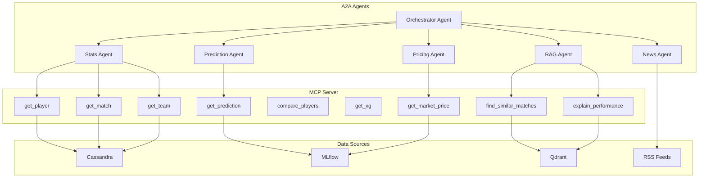

---

## End-State Summary

Six layers, bottom to top:

```
Data (Kafka, Spark, Cassandra)
  -> Model (Poisson regression, MLflow)
    -> Pricing (odds and margin, confidence-linked)
      -> RAG explanation (grounded in retrieved data)
        -> MCP server (typed tools any agent can call)
          -> A2A agents (Stats, Prediction, Pricing, News,
             coordinated by an Orchestrator)
```

Each layer only adds value if the layer beneath it is trustworthy.
This is why the build order is data and model first, pricing and
explanation next, and agentic coordination last — once there is
something real for agents to coordinate around.

| Layer | Status |
|---|---|
| Data | Built and working |
| Model | Built, backtested with out-of-sample season split |
| Pricing | In progress |
| RAG | Planned |
| MCP | Planned |
| A2A | Planned |

---

## Why These Design Choices

**Poisson regression, not deep learning, for match outcomes.**
Football outcome data is small (thousands, not millions, of matches
per league per season) and non-stationary — a 2015 match has minimal
predictive value for 2026, since squads and tactics change every
season. Deep learning would overfit on this scale of data without
outperforming a well-specified statistical model. Deep learning is
reserved in this project's roadmap for tasks where it genuinely
fits: video-based tracking or shot-level xG, not season-to-season
outcome prediction from box-score results.

**Season-based train/test split, not random split.**
A random split across seasons risks temporal leakage — training on
a March 2026 match while testing on an August 2025 match from the
same season lets the model "see the future" relative to what it is
being evaluated on. Splitting by season keeps every test match
strictly after every training match, mirroring how the model would
actually be used in production.

**Calibration over raw accuracy as the evaluation metric.**
For pricing, whether a 70% prediction is correct 7 times in 10
matters more than whether the single most likely outcome was
predicted correctly. A model can have modest raw accuracy and still
be well-calibrated and useful for pricing, which is why evaluation
in this project tracks calibration alongside accuracy, not accuracy
alone.

**Confidence flag drives margin, not just a display label.**
Rather than silently falling back to a league-average estimate for
teams with no training history, the model surfaces this as a LOW
confidence flag. That flag becomes an actionable pricing input:
LOW confidence widens the margin, directly mirroring the
human-in-the-loop, uncertainty-aware pattern already used
elsewhere in this project.

---

## How to Use These Diagrams

**In your GitHub README:** paste any diagram block directly — GitHub
renders Mermaid natively, no extension required.

**In Lucidchart or draw.io:** Insert -> Advanced -> Edit Diagram (XML),
paste the Mermaid code, export as PNG or PDF for presentations.

---

## Product Mockup: Layer Stack (Demo View)

This is the simplified, presentation-friendly version of the layer
stack shown above — useful for walking through the story in an
interview or demo, without the full technical detail of the
Container diagram.

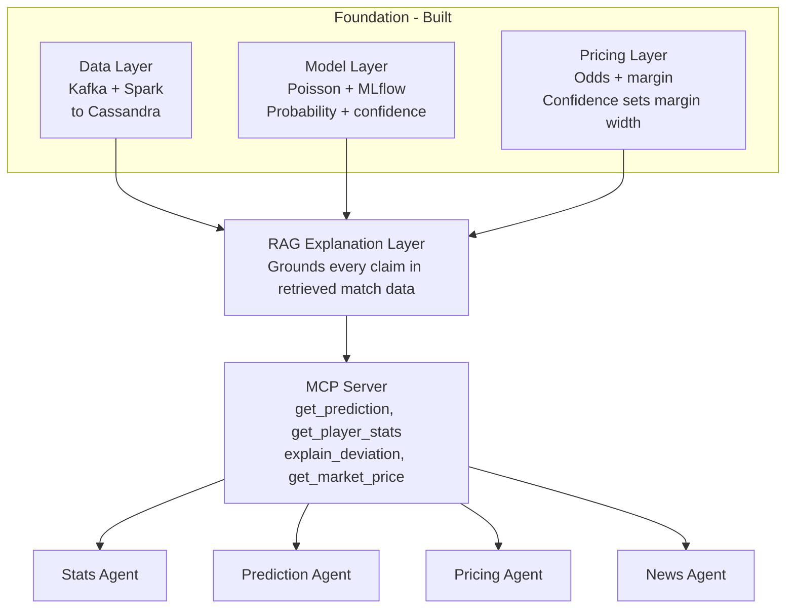

**The talking-through order (bottom to top):**

1. **Data layer** — reliable ingestion first. No prediction matters
   if the pipeline underneath it is unreliable.
2. **Model layer** — a statistically justified model, honestly
   backtested out-of-sample, with a confidence signal rather than
   false precision.
3. **Pricing layer** — the bridge from a probability to a business
   decision: fair odds, then a margin that widens under uncertainty.
4. **RAG explanation layer** — turns the number into a grounded,
   human-readable explanation, never hallucinating a statistic that
   isn't in the retrieved data.
5. **MCP server** — exposes all of the above as typed tools any
   agent (including Claude itself) can call, without needing to
   know anything about Kafka or Cassandra underneath.
6. **Agentic layer** — specialised agents, each doing one job,
   coordinated by a single orchestrator. Built last, deliberately —
   agentic coordination is only meaningful once there is something
   real underneath for the agents to coordinate around.
